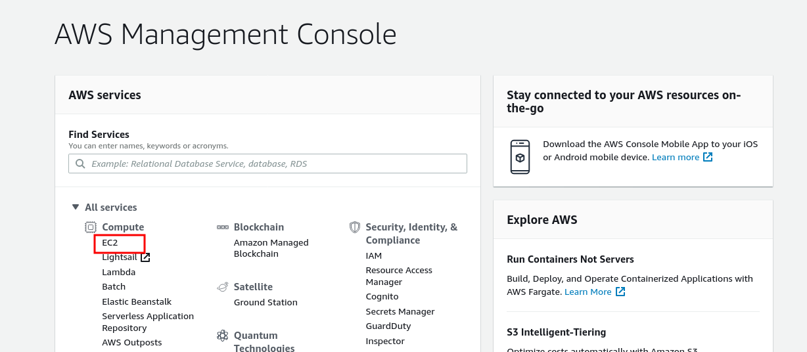
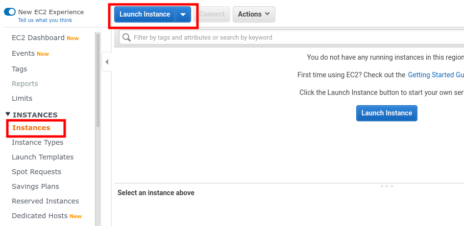
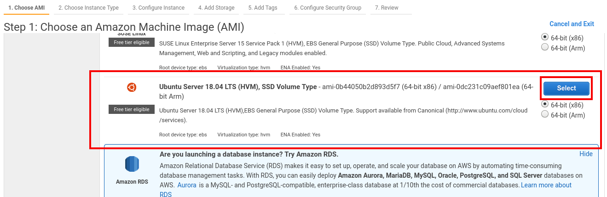
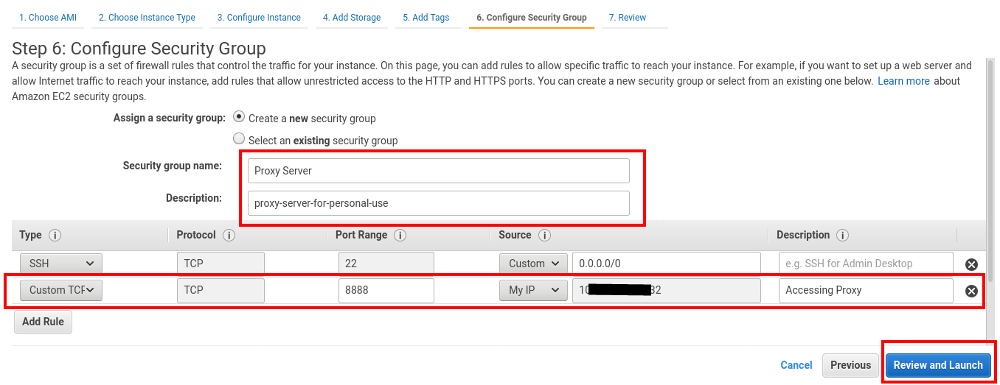
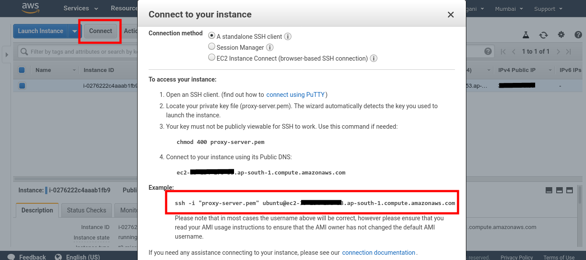
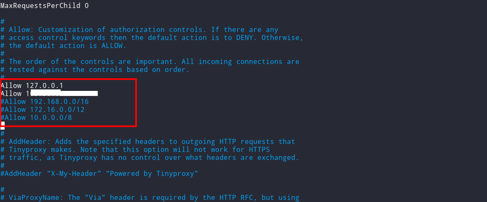
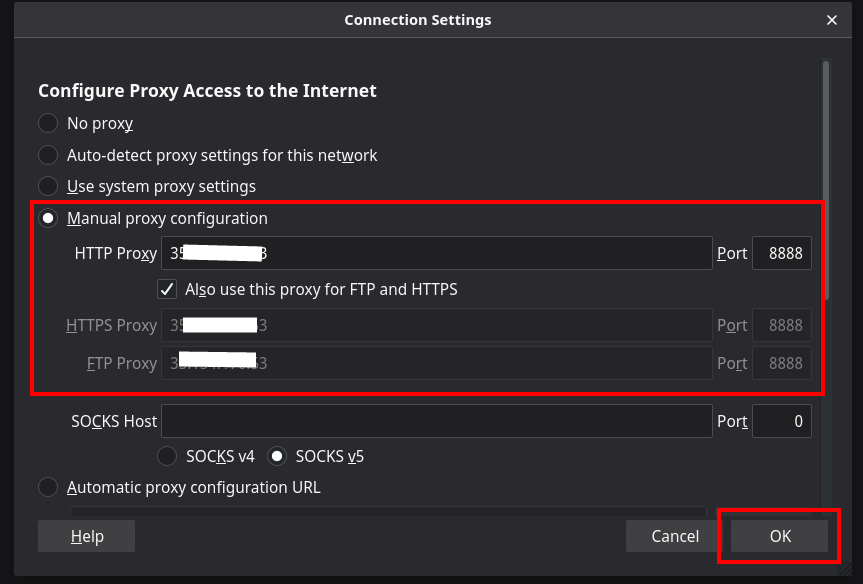

We are living in 2020, and both users and internet applications can take the benefit of cybersecurity. One of the best ways to be secure while browsing the Internet is by using <Special>proxy servers.</Special>
The proxy server is an important thing to know about nowadays. Let's see what makes proxy servers an essential aspect of cybersecurity support.

Thanks to [traking cookies](https://support.mozilla.org/en-US/kb/enhanced-tracking-protection-firefox-desktop?redirectlocale=en-US&redirectslug=enable-and-disable-cookies-website-preferences), [browser fingerprinting](https://robertheaton.com/2017/10/17/we-see-you-democratizing-de-anonymization/) and [ Internet Service Providers (ISPs) selling our browsing logs to advertisers](https://www.privacypolicies.com/blog/isp-tracking-you/), online anonymity is out like COVID 19 virus, everybody knows about it, but few are doing something about it. While your next-door-neighbour might not know where to find you online, but there is at least one large corporation (you know whom I am indicating G..... 😅), which has a series of 0's and 1's stored in their database <Special>which represents you</Special>, specific details of what you buy, what you like, what you don't, including your favourite ice cream flavour.

There are few ways to stop this, like using a corporate firewall, using Tor, or maybe a VPN. But in this blog, we'll see a free and effective way to <Special>stay secure online.</Special>

### What's a proxy server, anyway?

A proxy, in the English definition, is the <Special>"authority or power to act for another."</Special> A proxy server, in the computing context, is a server that acts on behalf of another server, or a user's machine.

By using a proxy to browse the Internet all of the user's Internet traffic appears to come from the proxy server instead of their machine.
To set up a free high-speed proxy server all you need is a [free tier AWS account.](https://aws.amazon.com/free/)

Follow the steps below to create a proxy server.

**Step 1:** Go to the AWS console and select EC2 from the services.



**Step 2:** Select Instances from the left panel and then click in Launch instance.



**Step 3:** From the list, select Ubuntu Server 18.04 LTS, and click in next.



**Step 4:** Click on continue and keep default configuration until you reach the Security Group configuration.
Create a new security group, add a security group name and a small description. Then add a new rule, set Type to Custom TCP, and set Port Range to <Special>8888</Special>. In source, choose My IP from the dropdown. Click on Review and launch.



Make sure to <Special>create new SSH keys and download it</Special> from the
popup after clicking on Review and launch.

**Step 5:** Once your instance is created, click on the Connect button, and copy the ssh command as shown in the image below.



**Step 6:** Open a terminal, and run this the following command. If you are on the windows machine, I highly suggest you [use Putty](https://linuxacademy.com/guide/17385-use-putty-to-access-ec2-linux-instances-via-ssh-from-windows/) for connecting to the EC2 server.

```bash
# Goto the directory where the key is download.
chmod 400 proxy-server.pem

# Paste the code copied from AWS.
ssh -i "proxy-server.pem" @ec2-12-345-678-90.ap-south-1.compute.amazonaws.com
```

Now, you'll get a shell in the AWS EC2 server.

**Step 7:**

```bash
sudo apt update && sudo apt upgrade
sudo apt install tinyproxy
```

This will get you all the dependency needed. We will use <Special>TinyProxy</Special> to setup our Ubuntu Server as the Proxy. By default, TinyProxy operates on Port 8888. Now we need to modify the configuration file of TinyProxy to allow the only IP address of your machines.

**Step 8:**
For this step, you should be familiar with the VIM text editor. If you are not, I'll soon write a detailed blog for VIM too.

```bash
sudo vim /etc/tinyproxy/tinyproxy.conf
```

Look for `Allow 127.0.0.1` line and add your public IP, as shown below.



To know your IP, run this in a new terminal.

```bash
curl ifconfig.co
```

You will get your public IP there.

**Step 9:** The final step is to restart the tinyproxy to reflect the changes we made.

```bash
sudo /etc/init.d/tinyproxy restart
```

### How to use this Proxy?



To browse the Internet via this Proxy, we <Special>need to set up our browser to use this Proxy.</Special>

In the firefox browser goto preferences from right top corner options, and search for Proxy. Choose manual proxy configuration, and in HTTP proxy add your AWS EC2 public IP(you can get the public IP from AWS EC2 dashboard), in Port add 8888. Make sure to check the `Also use this Proxy for FTP and HTTPS` checkbox. Click, OK, and you are good to go.

To verify go to Google, and search `what is my IP`. You will see your AWS EC2 IP, that means all your data is routed via AWS servers. <Special>This means there is no more restriction on which site you can access. All sites are unlocked for you😁. Enjoy!</Special>
