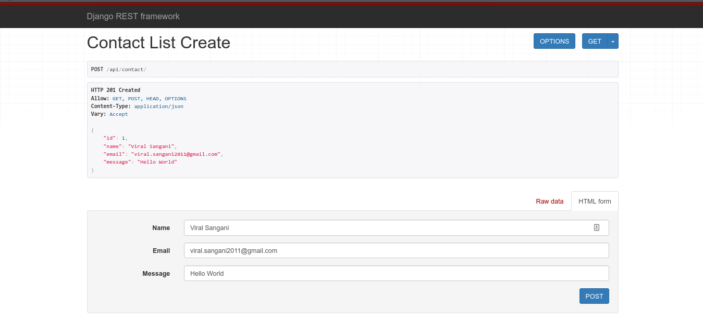
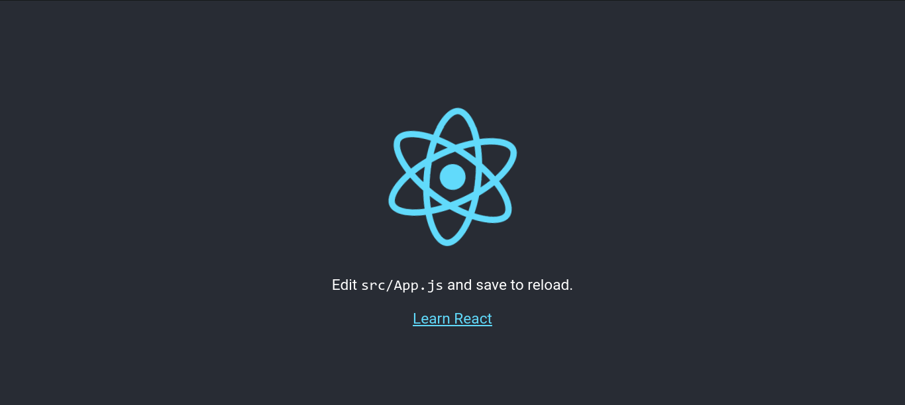
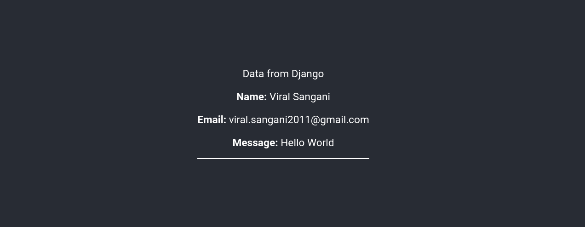

Django and React is an excellent combination. With React's SPA and Django's long list of essential libraries, we can create outstanding website apps. For this application to work, React will have to interact with Django, i.e., retrieving and storing data. To create the interface with integration, we will create API in the Back-end(Django) and consume that API in Front-end(React).

### Requirements to follow along with this post

- a basic understanding of Python and Django
- a basic understanding of JS(ECMAScript) and ReactJS

Let's start coding.

#### Setting up a virtual environment for the project

Never forgot to create a virtual environment for a Django project. Create a folder for your project and move into it. :

```bash
mkdir django-react && cd $_
```

Install dependency for the python environment, and create a virtual environment.

```bash
sudo apt-get install python3-venv
python3 -m venv venv
source venv/bin/activate
```

Now pull the dependencies for Django and rest framework.

```bash
pip install django djangorestframework
```

When it completes, you can create a Django project.

```bash
django-admin startproject django_react .
```

Now we can start building the Django app to store and display contact information.

### Building Django application

To create an app in Django, run this command,

```bash
python manage.py startapp contact
```

After creating this app, your folder structure should look like this,

```bash
(venv) viral@sangani: $ tree -d -L 1
.
├── contact
├── django_react
└── venv

3 directories
```

Now let's inform django about this newly created app, move to `django-react/settings.py,` and add the app in `INSTALLED_APPS.`

```python
INSTALLED_APPS = [
    'django.contrib.admin',
    'django.contrib.auth',
    'django.contrib.contenttypes',
    'django.contrib.sessions',
    'django.contrib.messages',
    'django.contrib.staticfiles',
    'contact', # activate the new app
]
```

So far, so good that we created a basic layout for the project; in the next section, we will add our models.

### Creating Django models

Model is nothing but an object representing a table's data from the database. Almost all advanced web framework uses models, and Django is no exception.

Since we are creating a contact app, let's add related table fields
Eg: `name`, `email`, `message`, `created_at`.
Your `contact/models.py` should look something like this,

```python
from django.db import models

class Contact_info(models.Model):
    name = models.CharField(max_length=100)
    email = models.EmailField()
    message = models.CharField(max_length=300)
    created_at = models.DateTimeField(auto_now_add=True)
```

You can go crazy using more fields for the model, but we will have only a few fields for the sake of simplicity. Check out [django docs for more advanced model fields](https://docs.djangoproject.com/en/3.0/topics/db/models/).
Once you are done with creating models, we can migrate those model to a database via these commands,

```python
python manage.py makemigrations contact
python manage.py migrate
```

### Few things about testing

You might be thinking this is a Django + React post, why am i talking about testing. Testing is a really important part of any project. I have seen many django test code like this:

```python
class SomeModelModelTest(TestCase):
    def setUp(self):
        SomeModel.objects.create(
            name=fake.name(),
            email=fake.email(),
            phone=fake.phone_number(),
            message=fake.text(),
            source=fake.url()
        )
    def test_save_model(self):
        saved_models = SomeModel.objects.count()
        self.assertEqual(saved_models, 2)
```

Never do that; there is no point in testing vanilla Django classes nor Django models. Do not test those <Special>things which are already tested.</Special> If you have added a custom function of created custom manager for your model, <Special>Test it</Special>. You have a custom view in you views.py, then <Special>Test it.</Special>

You might get a question, how to know what I should test? Do yourself a favour and install <Special>Coverage</Special>.

```bash
pip install coverage
```

Every time you add something in the project, run this coverage on the test to know what exactly you have missed in your tests.

```bash
coverage run --source='.' manage.py test
```

and then you can generate HTML with this tool,

```bash
coverage html
```

If you are still there, then in the next section, we will create our serializers for REST APIs.

### Creating Django REST serializers

What is serialization? It is the act of transforming an object into another data format. In our case, from database values to a JSON object. How to do that? Using Django REST serializer!

You can use the Django REST serializer, which will take the burden off you, but there might be some complex cases when you just can't figure out how to do that; in that case, you have to serialize data manually, there are functions in djangorestframework to do so.

In this case, we will take advantage of Django serializers. Create a file `contact/serializers.py,` and then create a ContactSerializers.

```python
from rest_framework import serializers
from .models import Contact_info

class ContactSerializer(serializers.ModelSerializer):
    class Meta:
        model = Contact_info
        fields = ('id', 'name', 'email', 'message')
```

### Settings up Views and URLs

Open `contact/views.py` and create this view,

```python
from .models import Contact_info
from .serializers import ContactSerializer
from rest_framework import generics

class ContactListCreate(generics.ListCreateAPIView):
    queryset = Contact_info.objects.all()
    serializer_class = ContactSerializer
```

This is the magic of Django, just with three lines, we have created POST and GET views for Django.

Let's focus on URLs. To configure the URLs, we need to include app URLs in `django_react/urls.py.`

```python
from django.urls import path, include

urlpatterns = [
    path('', include('contact.urls')),
]
```

Next up, create a new file `contact/urls.py.` Then we will connect our `ContactListCreate` view to a URL.

```python
from django.urls import path
from . import views

urlpatterns = [
    path('api/conatct/', views.ContactListCreate.as_view() ),
]
```

Finally, add the Django rest framework in `django_react/settings.` Add `rest_framework` in INSTALLED_APPS.

```python
# Application definition

INSTALLED_APPS = [
    # omitted for brevity
    'contact',
    'rest_framework'
]
```

Now you can check the working with

```bash
python manage.py runserver
```

Go to browsable API at <Special>http://localhost:8000/api/contact/</Special>



### Moving to ReactJS

I have seen many Django developers struggle with this question, <Special> How to glue Django and React</Special>. Believe me; I have gone through this phase.

Some common question that comes to mind is, <Special>Should React Router takes over the routing? or should React mount each component in Django template?</Special> I would say <Sparkles>it depends.</Sparkles> It depends on how good you are with javascript.

So there are <Sparkles>Two ways</Sparkles> to setup Django and ReactJS.

**Option 1**

React in its own `frontend` Django app. Load a single HTML template via Django and let React do its thing.
(difficulty: medium)

**Option 2**

Django Rest Framework as a standalone API and React as standalone SPA. (difficulty: medium-hard, it involves authenticating via JWT. I will write a blog for DRF and JWT soon.)

In this post, we will go through **Option 2**. If you want me to go through **Option 1** as well, let me know at [viral.sangani2011@gmail.com](mailto:viralsangani.2011@gmail.com)

Since we are moving with Option 2, we need to make a few changes in the Django app so that it will allow our React app to communicate via APIs.
We need to install `django-cors-headers.`

```bash
pip install django-cors-headers
```

Now, head over to `django_react/settings.py` and add these lines.

```python
INSTALLED_APPS = [
    # omitted for brevity
    'contact',
    'rest_framework'
    'corsheaders' # <== This is new
]
```

In the same file, edit this.

```Python
MIDDLEWARE = [
    ....
    'corsheaders.middleware.CorsMiddleware', # <== Add this line in MIDDLEWARE
    'django.middleware.common.CommonMiddleware',
]

CORS_ORIGIN_ALLOW_ALL = True # <== Add this line anywhere in the settings.py
```

`CORS_ORIGIN_ALLOW_ALL = True` will allow all IP to connect to our APIs. This is okay for development, but if you want to restrict this, you can create a Whitelist of IPs. Go through [this](https://pypi.org/project/django-cors-headers/) to know more.

Greate now Django part is over, we can move to React.

### ReactJS

Requirements: You need to install npm and nodejs to follow along.

Let's create a react app using `create-react-app.` If you don't have `create-react-app,` I'd suggest you go [here](https://github.com/facebook/create-react-app).

You can create a new folder `django-react-frontend` somewhere else, and follow along.

```bash
npx create-react-app django-react .
```

We will install a few dependencies to react.

```bash
npm install axios --save
```

[Axios](https://github.com/axios/axios) is the promise-based HTTP client that we'll use to make HTTP request calls to our Django API.

Now you have your basic react app ready.



Now Let's edit out `App.js` to make an API call via axios to Django. Make sure your Django server is online at `http://localhost:8000`.

Paste this code in `App.js.`

```js
import React from 'react'
import './App.css'
import axios from 'axios'

function App() {
  const [values, setValues] = React.useState([])
  React.useEffect(() => {
    axios.get('http://localhost:8000/api/contact/').then((res) => {
      console.log(res.data)
      setValues(res.data)
    })
  }, [])
  return (
    <div className="App">
      <header className="App-header">
        <p>Data from Django</p>
        {values.length > 0 &&
          values.map((value) => {
            return (
              <div key={value.id} style={{ borderBottom: '2px solid white' }}>
                <p>
                  <strong>Name:</strong> {value.name}
                </p>
                <p>
                  <strong>Email:</strong> {value.email}
                </p>
                <p>
                  <strong>Message:</strong> {value.message}
                </p>
              </div>
            )
          })}
      </header>
    </div>
  )
}

export default App
```

This will make a call to DRF and display that data.



This is a straightforward example of the integration of Django and React. You can do many things now.

In this post we have learned,

-> build a Django REST API  
-> structure Django Project with React  
-> connect React to Django API

Feel free to change and add new feature to the project.
