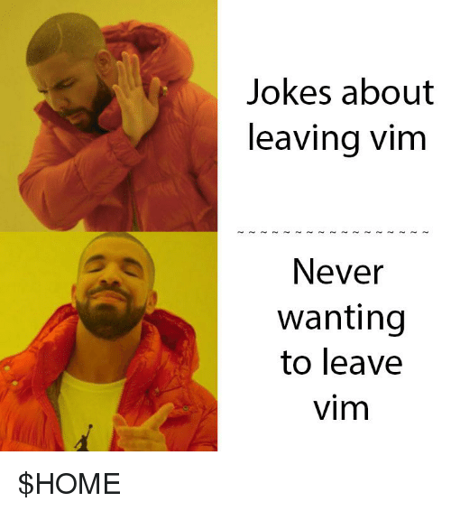
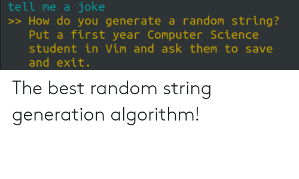

If you are new to VIM, you might want to read my previous post on VIM.
This is the 2nd part of the five-part series on VIM.



### A Taste of VIM Editor

Those who are not a regular VIM user, they might use some normal text editor like, VSCode, Atom, Sublime, etc.. (unless you are some freak using `emacs`), and the main aim of those normal text editor is to insert the text, and that's what they are made for. I don't know about others but 75% of my time while coding and programming I tend to edit the code rather than inserting the code. That's what most developers do, they write the code once, then they spend most of the time editing and customizing that code. Now, when it comes to VIM, VIM is not like other text editors whose main aim is to insert the code, rather VIM focuses more on the editing part. With vim, you can edit the code like a wizard.
For example, let's say you want to make similar changes in 15 lines of a file. If you are using a normal text edit, you scroll the mouse, find each line, and make the change. But with VIM, you make the change in one line, and VIM remembers it, then all you have to do is press `.` (period), and VIM repeats its last set on command and BAMM, you get the changes in another line with just a keystroke. But it's hard to write commands which work well with `.` but you can learn it with some practice.

Let's starts with some basics and build our way up.

First thing first, if you are stuck anywhere in VIM, just call for `: help` and help will come for rescue. VIM's `: help` command is very well documented. Get help with `:help {whatever}` or with a shorter version `:h {whatever}`.

-> With vim, you don't have to move your hand to arrow keys to move around a file, you can simply use, letters `hjkl`. When you type on a keyboard, your hand rests firmly on these keys, hence it's a faster way to move around a file.
These keys move the cursor left, down, up, and right respectively.

You can also move left to right by words with `w` (goto starting of the word) or `e` (goto end of the word). you can use `b` to do the same but in right to left direction.

In the world of VIM, with great keys comes great power. In normal mode, just type `daw` and you just deleted a word, press `das` and you deleted a sentence, press `dap` and you just deleted a whole paragraph with 3 keystrokes.

Or you can be less of a devil who deletes stuff and can use `caw`, `cas`, or `cap` to change a word, sentence, or a paragraph. It's not the end, you can type `ctb` to change until first `b` in the current line, or use `c$` to change everything till the end of the line. You can use `ci{` to change the text between curly brackets or use `ci"` to change content between quotes.

Let's see an example, imagine you have a variable in python,

```python
x = "Hello World"
y = "How you doing?"
```

Now, you can change the text between those quotes with `f"ci"WHAT<ESC>`. By typing this you'll get this,

```python
x = "WHAT"
y = "How you doing?"
```

Now, VIM remembers your last command, so if you press `j.`, you'll get,

```python
x = "WHAT"
y = "WHAT"
```


Let's break down these commands, in 1st one `f"` finds the `"`, then `ci"` change the content between those quotes and put you in insert mode, with `WHAT<ESC>`, it inserts the WHAT word and `<ESC>` put you back in normal mode.

In 2nd command, `j` put your cursor down one line, and `.` repeats your last command, which was to change content between quotes and insert `WHAT` in between.

With VIM you can copy the content in the same way, but in VIM copy is called yank. It's just a jargon VIM people use.
So now, just like delete use `d`, change use `c`, you can use `y` to yank the content. To yank a word press `yaw`, to yank a sentence press `yas` and to yank a paragraph press `yap`.

To make it simple you can press `dd` to delete your present line, press `cc` to change current line, and press `yy` to yank your current line.

With the power of these commands, you can do a lot more, like the previous example, you can press `kJ`, and you'll get this

```python
x = "WHAT" y = "WHAT"
```

and now press `c3w+<ESC>`, you'll get something like this,

```python
x = "WHAT"+"WHAT"
```

This is not at all useful examples, but hey you get the idea of what you can do in VIM.
In the previous example, I have used `count {3}` to get the longer motion. For example, if you want to go 13 lines up, press `13k`. It follows a syntax `{count}{command}`, which means you can add the count to any command, even to `.` which is a repeater command, so if you press `10.`, it will run the last command 10 times.

One thing you will miss most in VIM is the freedom to navigate freely with a mouse scroll. You don't want to be that person who presses `j` 30 times to reach the desired line. But hey, VIM has way around for that too, press `D` to move a few lines down at a time and press `U` to move a few lines up, that ease up the pain of pressing the same key multiple times. You can even you `{` and `}` for a paragraph up or down respectively. If you are coding you can use `%` to find the matching ending parentheses.

You can enter insert mode by pressing `i`, if you want to insert in the new line, press `o`, and if you want new above the current line press `O`.

My favorite command id `/`, you can use `/{patter}`, to move to any place in the document you want. Once you find your matching patter, press `n` to find the next matching pattern.

So much at your fingertip, and you have barely left normal mode. There is much much more like there are splits, there's a regex, there are tabs, there's is access to hundreds of community-based extensions for VIM, there is spell checking, word count, file tree, everything coming in next posts. So excited?

One last thing, you might be thinking, how can someone remember so many commands there is `caw` there is `ciw`, `10j`, `dd` `d3w`, etc.. See that's the beauty of VIM, you don't have to remember it. The operators and command make incredible sense. VIM use mnemonics like `c` means change, `d` means delete, `cl` means change letter, `daw` means **d**elete **a** **w**ord, `ciw` means **c**hange **i**nner **w**ord. `cta` means **c**hange **t**ill you find `a` and so on.

VIM is like programming I guess, where you are in control, and change the core mechanism of file editing and writing text. If you are familiar with git and how it works with source control of your project, you can think of VIM as a git of text editing. Once you have experience with VIM, you will no longer see the text as normal text, you will see the text as an infinite number of possibilities to change that text being applied just like Neo awakening to the matrix. (Got that ref?? let me know in the comment...)

To learn more about vim, you can watch this really awesome [talk](https://www.youtube.com/watch?v=wlR5gYd6um0) by Chris Toomey. In the talk, he explained how to think in VIM language and do all those crazy stuff more efficiently.



I just wanted to end with a Joke. 😇
