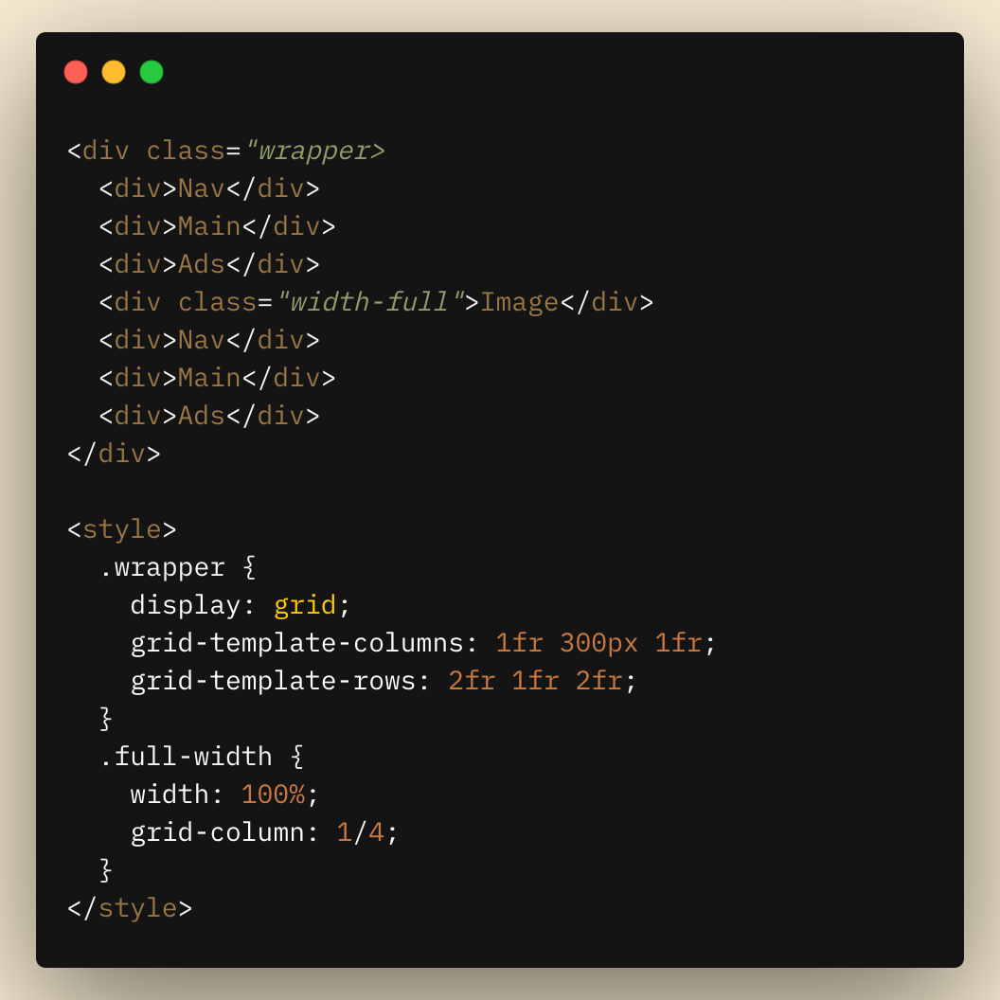
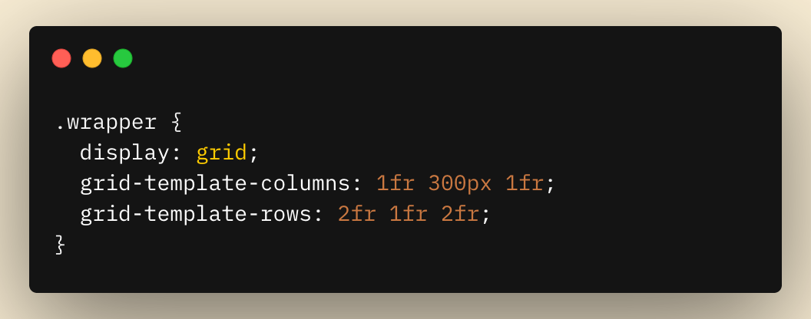

It was difficult back in old times to create <Sparkles>Holy Grail Layout</Sparkles>, but not anymore, using CSS Grid. If you are developing a website since maybe 5-6 years ago, you can relate to this. Creating the website layout without using Flexbox and Grids. The only tools at developers' disposal were tables and floats, neither was up to the standard to create flexible layouts. It was technically possible, but require a few <Special>Jugaad</Special> (Hindi word for Makeshifter).

<div className="flex flex-col items-center justify-center">
  <div className="blog1-container w-full md:w-4/6 lg:w-4/6">
    <div className="blog1-wrapper">
      <div className="header">Header</div>
      <div className="nav">Nav</div>
      <div className="main">Main</div>
      <div className="ads">Ads</div>
      <div className="footer">Footer</div>
    </div>
  </div>
  <span className="text-sm text-light-primary dark:text-dark-primary py-2">
    ( Drag from bottom right )
  </span>
</div>

This layout is called <Special>Holy Grail Layout</Special> maybe because it was difficult to achieve at the beginning, but then comes Grid support for all major browsers and this layout went from <Special>Holy Grail Layout</Special> to <Special>Tap Water Layout</Special>. Everyone was using it because of its flexibility and the ability to do so many things with so little effort.


When first I created my blog, I was using Flexbox and I found myself using tons of `div`s to make the layout I want. Then I implemented Grid, and suddenly I was using 40% less code in layout building. In this article, we will go through the top-level view of Grid.

<Note>
  I am assuming you know basics of Grid. If you don't I recomment to read this
  article by Chris House on css-tricks.com -{' '}
  <a href="https://css-tricks.com/snippets/css/complete-guide-grid/">
    https://css-tricks.com/snippets/css/complete-guide-grid/
  </a>
</Note>

You might have seen a fixed layout with content in the center and extra padding on each side. This kind of layout is everywhere magazines, blogs, documentation, etc... In fact, you are seeing the same layout on this website.

<!-- TODO: IMAGE HERE -->

You can see the fixed-width content in the middle. It does not necessarily have to be fixed into that container. You can make custom items to break free and fill all available space.

<div className="flex flex-col items-center justify-center">
  <div className="blog1-container w-full md:w-4/6 lg:w-4/6">
    <div className="blog1-wrapper" style={{ gridTemplateRows: '2fr 1fr 2fr' }}>
      <div className="nav">Nav</div>
      <div className="main">Main</div>
      <div className="ads">Ads</div>
      <div className="image">Image</div>
      <div className="nav">Nav</div>
      <div className="main">Main</div>
      <div className="ads">Ads</div>
    </div>
  </div>
  <span className="text-sm text-light-primary dark:text-dark-primary py-2">
    ( Drag from bottom right )
  </span>
</div>

If you think this is a bit complex, believe me, it's not. Let's see how to achieve something like this below.

## Solution



I know it's a lot to take. Let's break this down.

### The Grid



Let's go one-by-one and see,

<Note>- Make sure parent `div` should have `display: grid` set.</Note>

`grid-template-columns` is a CSS grid property that helps us to define the shape of our layout. If you have noticed, we have provided 3 values in `grid-template-columns`, this signifies that we want 3 columns in our layout.

This will only create the columns, but the items in those columns define the width of the column. In the above example, the first and last value is `1fr`. `fr` basically is a flexible unit that will expand in the available area. You can compare `fr` with `flex: grow`. For the center column, we have given 300px for fixed width, but users can use a `min` function to calculate between 300px and 100% width, which will eventually make it responsive. See below for an example.

<div className="flex flex-col items-center justify-center">
  <div
    className="blog1-container w-full md:w-4/6 lg:w-4/6"
    style={{
      height: 200,
      minWidth: 10,
      resize: 'horizontal',
    }}
  >
    <div
      className="blog1-wrapper"
      style={{
        gridTemplateRows: '1fr',
        gridTemplateColumns: '1fr min(300px, 100%) 1fr',
      }}
    >
      <div className="nav">Nav</div>
      <div className="main">Main</div>
      <div className="ads">Ads</div>
    </div>
  </div>
  <span className="text-sm text-light-primary dark:text-dark-primary py-2">
    ( Drag from bottom right )
  </span>
</div>

<Note>
<Special>Tip</Special>

If you are confused about what should be the width of the middle column for your website, you should consider using `ch`. In recent research, it has shown that ideal characters in a line should be 65. Either we can guess the width of 65 characters in pixels or we can use the `ch` unit in CSS.

We can use `ch` similar to `rem` and `px`. It represents the with of character `0` in the current font, for specific font size. So instead of figuring out the width of the column from font size, wouldn't it be better if we just let CSS calculate that for us?

</Note>

### A Use case

Let's suppose you want a layout, where all the content is in the center column. By default, all the children will be slotted into the first grid that is available sequentially. What if we want to override this and define some of our rules. All children should sit in the middle column whereas the first and last columns are flexible and empty. You can do all of this with just one line.

```css
.wrapper > * {
  grid-column: 2;
}
```

Here, we are saying that I want to add all my content in the second column. <Special>Remember that the indexing of these columns starts from one.</Special> See below for an example.

<div className="flex flex-col items-center justify-center">
  <div
    className="blog1-container w-full md:w-4/6 lg:w-4/6"
    style={{
      height: 350,
      resize: 'horizontal',
    }}
  >
    <div
      className="blog1-wrapper"
      style={{
        gridTemplateRows: '1fr 2fr 1fr 1fr',
        gridTemplateColumns: '1fr min(250px, 100%) 1fr',
      }}
    >
      <div className="main"></div>
      <div className="nav">
        <h3>Hello</h3>
      </div>
      <div className="main"></div>
      <div className="main"></div>
      <div className="nav">
        <h3>Friend</h3>
      </div>
      <div className="main"></div>
      <div className="main"></div>
      <div className="nav">
        <h3>How</h3>
      </div>
      <div className="main"></div>
      <div className="main"></div>
      <div className="nav">
        <h3>are you???</h3>
      </div>
      <div className="main"></div>
    </div>
  </div>
  <span className="text-sm text-light-primary dark:text-dark-primary py-2">
    ( Drag from bottom right )
  </span>
</div>

### Using 100% of our ~~brain~~ width 😅

From the above example, you might be thinking what if I want one of the div to go rogue and take full width irrespective of side columns? Don't worry, the grid has a solution for that too.
You can set the `grid-column` property of a particular item you wish to take full width to `1 / -1`. In our case, you can also specify it to `1 / 4`, which defines that we want to span from column 1(inclusive) and column 4(exclusive).

If you are trying to recreate this for your website, you might see that in mobile view, when it takes 100% width, it just looks too stretchy, right? That's because we are not giving any padding to our content when it's at 100% width. If you suggest we can achieve this by simply adding padding to our content in the middle column then you are 100% right. But this is a Grid/Layout article so we will give padding in Grid style. You might need a little bit 🤏🏻 of mathematics for it. Let's see the solution:

```css
.wrapper {
  display: grid;
  grid-column-gap: 64px;
  grid-template-columns: 1fr min(60ch, calc(100% -128px)) 1fr;
}
```

Here would be taking help from `grid-column-gap`. `grid-column-gap` is a grid property that allows us to add gutter/space between each column. In the above code, we have defined our gap at 64px. Now this will create a problem since we would be adding 64px on each side along with 100% width, it will show us a dreaded horizontal scrollbar on small device view.

To solve this we bring in a CSS property called `calc`. `calc` is a mathematical function that allows us to use some logical code inside CSS. Now what we want to do is, when it's 100% width, we want to subtract 126px(64px for each side) from it. The function would look something like this - `calc(100% - 128px)`.

### Let's Conclude

I think Grid is the best thing that happened to CSS after Flexbox😅. Some people still think this could be easily accomplished with flexbox, and you are not wrong, but down the road, there will come a point where you want to modify UI and add some new components and images, it would be too easy to achieve all this if you have used <Sparkles>CSS Grid.</Sparkles> Anyway, there is always a trade-off for using any tool and property.

The main aim of this article was to let you know that there is a property called grid in CSS, which will make your life easier and make you a better developer.

That's it for this article. If you like it and want to come say hi, you can find me on Twitter - [@viral_sangani](https://twitter.com/viral_sangani_).


