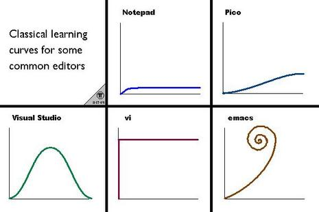

In the past, I am stuck with this idea of making more with less, in the context of refactoring the line of code in the most efficient way possible. Recently I am exploring the use of VIM to [unleash unlimited power](https://www.youtube.com/watch?v=kNS4t5UCBfI) of a text editor. VIM enables me to achieve more with every keystroke and with every hour I invest in programming.

This is the 1st part of the five-part series on VIM.

### Let's talk about [VIM](https://www.vim.org/).

VIM is a text editor who has a keyboard-centric design, unlike other text editors. <Special>VIM promises ultimate productivity to those who dare to face its steep learning curve and survive till the end to tell the tale.</Special>

I have been learning VIM for the past 2 months. To be honest, it was tough for the first week, but if you make it through the first week, trust me it's <Sparkles>worth it.</Sparkles> My first encounter with VIM was a year ago, when I saw my brother typing a bunch of command in vim to do some editing in one line and then he played the recorded command 100 times, and BOOM, 100 lines of code were changed with just a keystroke. That was fascinating. Since then I tried to use VIM as my primary text editor, but just because of the steep learning curve, I always gave up. But a couple of months ago, I came up with this [YouTube playlist](https://www.youtube.com/playlist?list=PL8tzorAO7s0jy7DQ3Q0FwF3BnXGQnDirs) by [ThoughtBot](https://www.youtube.com/channel/UCUR1pFG_3XoZn3JNKjulqZg). When I suggest someone to use VIM, their first question is <Sparkles>CAN IT DO THIS...</Sparkles>. And the answer is <Sparkles>YES.</Sparkles> Just go through this playlist and all your questions will be answered.

Till this time, I haven't used 50% of the functionalities VIM offers, or that know about. However, I never completely shifted to VIM, instead, I use VIM extension for popular text editors like VSCode or PyCharm, etc. This will give you the flavor of both. You have you VSCode shortcuts + the power of VIM at your fingertip. Although using VIM with other text editors is not as good as the real thing, but for beginners, this is the best bet to get used to VIM quickly.

### Answering, what is VIM?

[VI](https://en.wikipedia.org/wiki/Vi) is the ancient text editor created in 1976. The main purpose of creating VI is to make a text editor that works perfectly on a terminal. Later came the VIM(Vi IMproved) which has support for both text and graphical interfaces. It comes as the improved version of VI which technically supports all the operating systems known to mankind.

### Why VIM but?

You might be thinking why should I care about some ancient text editor in 2020? VIM is a text editor that provides a different method of writing code. If text editors are compared to planets, VS Code, Sublime, ATOM, Jetbrains, Eclipse all are on the same planet and VIM is a <Special>different galaxy</Special>. It provides a way to interact with your code as no other editors can.

Now you might be thinking, what is there for me in learning VIM? See, VIM removes the dependency of MOUSE. Yes no more using a mouse, if you choose to go with VIM. Using VIM will make you a code surgeon. A code surgeon who can make precise code insertion whenever and wherever they want. If you are using one of those text editors other than VIM, you will be using a mouse to navigate in the code. But with VIM you can navigate into your code and codebase with lightning speed just using your keyboard. You don't even have to move your hand from keyboard to mouse. This is what you get from learning VIM, the speed, and the power of changing whatever you want with just a couple of keystrokes.

### What makes VIM such a great text editor?

There are this things called <Special>modes</Special> in VIM. There are primarily three modes in VIM, <Special>Normal Mode, Inset Mode, and Visual Mode</Special>. Each mode has it's own significance we will see in further posts. All the keystroke have different functionalities in every mode. For example, `d` key is used to delete and copy the text in Normal mode, were as if you are in Inset mode, `d` is just the letter `d`, which will be typed if you press `d` key. This helps VIM to provide more functionalities with limited numbers of keys.

VIM is extremely customizable. You can change your key binding However it suites you, and whatever works for you. There are no restrictions like many text editors where you can't help it. If you want to copy the selected text by just pressing `c`, instead of pressing two keys =>`Ctrl+z`, you can in vim, but it might be too hard or not possible in other text editors.

### Why VIM is hard?

Let's goto a darker side of VIM, or at least what some people think.

Let's see the learning curve of VIM.

Yes, VIM is consistently hard to learn, because learning never ends in VIM. Every day you google something about VIM, and you'll get some exciting new stuff related to VIM and it's plugins.

And then comes this,

But according to me, what makes VIM sooooo HARD is it's <Sparkles>Horrible first impression</Sparkles>.

So in the next few posts, I will try to make leaning VIM not that difficult and providing you basics and resources to learn advanced VIM.

Just a friendly advice, if you take the courage of learning VIM, don't stop in between, I know it will be painful at the start, but trust me there will come a day when you will be saving hours in a day just by using VIM.
